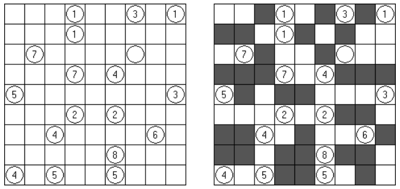

# Kurotto

##### Kurotto - 一种逻辑谜题。任务是矩形或正方形网格，一些方格含有方格（空白或数字）。要放置黑白方格在下列条件下：

* 有圈的方格不可能是涂黑的。
* 所有的黑色方格在横向或者纵向上必须是连续的，并且构成一个白色的空间。
* 每个圈中的数字恰好等于与其上下左右相邻的黑块组的占格数之和。
* 如果圆中不包含数字时，这个单元可以是任何大小的黑单元的相邻区域。

个人完成的一项非常有趣的工作。

有一天在玩ipad上的Kurotto游戏时想到的，会不会有一种办法可以求得问题的所有解，就像数独一样。

该项目所做的工作是 将该游戏转换成 sat(布尔可满足性问题)，并使用sat-solver（SAT求解器）得到了所有的解。

